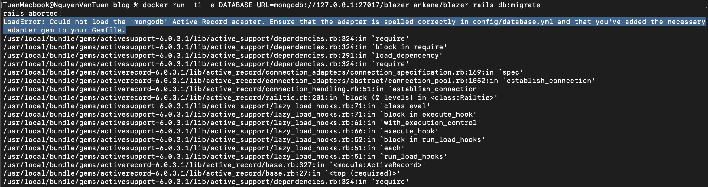

## TEST BLAZER

1. Run main.js
App will create two table:
`
User: { id, name, email}
Blog: { userId, title}
`
2. Pull the image of ankane/blazer
`
docker pull ankane/blazer
`
3. Create database tables
`
docker run -ti -e DATABASE_URL=mongodb://127.0.0.1:27017/blazer ankane/blazer rails db:migrate
`

I received an error: LoadError: Could not load the 'mongodb' Active Record adapter. Ensure that the adapter is spelled correctly in config/database.yml and that you've added the necessary adapter gem to your Gemfile.

